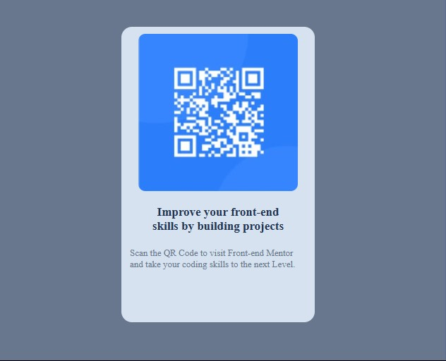

# Frontend Mentor - QR code component solution

This is a solution to the [QR code component challenge on Frontend Mentor](https://www.frontendmentor.io/challenges/qr-code-component-iux_sIO_H).

## Table of contents

- [Frontend Mentor - QR code component solution](#frontend-mentor---qr-code-component-solution)
  - [Table of contents](#table-of-contents)
  - [Overview](#overview)
    - [Screenshot](#screenshot)
    - [Links](#links)
  - [My process](#my-process)
    - [Built with](#built-with)
    - [What I learned](#what-i-learned)
    - [Continued development](#continued-development)
    - [Useful resources](#useful-resources)
    - [AI Collaboration](#ai-collaboration)
  - [Author](#author)
  - [Acknowledgments](#acknowledgments)

## Overview

### Screenshot



### Links

- Solution URL: [Add solution URL here](https://your-solution-url.com)
- Live Site URL: [Add live site URL here](https://your-live-site-url.com)

## My process

### Built with

- Semantic HTML5 markup
- CSS custom properties
- Flexbox
- CSS Grid
- Mobile-first workflow
- [Styled Components](https://styled-components.com/) - For styles

### What I learned

To see how you can add code snippets, see below:

```html
<h1>Some HTML code I'm proud of</h1>
- You can't enclose a <div> with <p> tag.
```

```css

.proud-of-this-css {
    display: flex;
    justify-content: column;
    align-items: center;
    margin: 0 auto;
}
```

```js
- No Javascript was used
```

### Continued development

- I would like to focus more on learning about accessibility and responsive design. I would also like to learn more about CSS Grid, Responsiveness and Flexbox, as well as how to use them together effectively.

### Useful resources

- [Example resource 1](https://www.example.com) - This helped me for XYZ reason. I really liked this pattern and will use it going forward.

### AI Collaboration

- What tools did you use ( ChatGPT, Claude, Gemini)?
- How did you use them -- I prompted to help solve the responsiveness of the mobile version by asking what specific elements I needed in the code rather than they providing the codes.?
- What worked well? What didn't? -- I think from nowonwards prompting the AI too code alongside with me is the best way to learn rather than cpoying the codes and this really opened my eyes in research basis.

## Author

- Website - [Add your name here](https://www.your-site.com)
- Frontend Mentor - [@yourusername](https://www.frontendmentor.io/profile/yourusername)
- Twitter - [@fabuloushope_](https://www.twitter.com/fabuloushope_)

## Acknowledgments

This is where you can give a hat tip to anyone who helped you out on this project. Perhaps you worked in a team or got some inspiration from someone else's solution. This is the perfect place to give them some credit.
